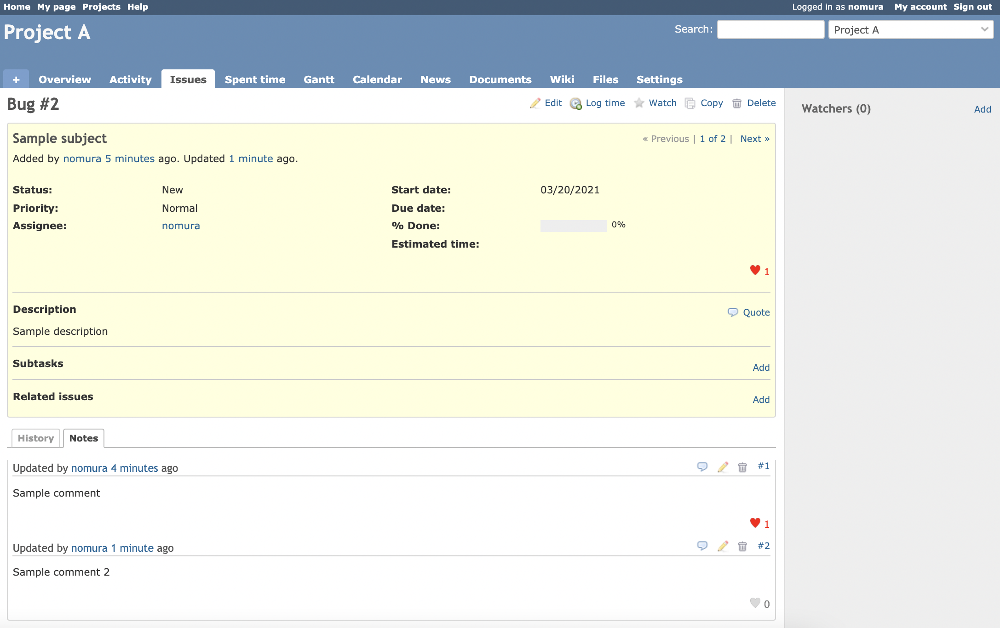
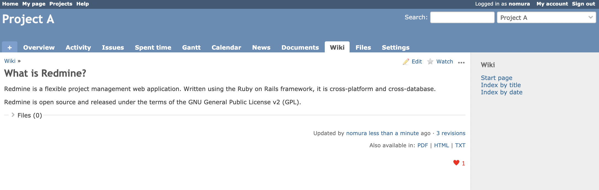
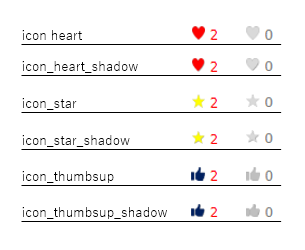
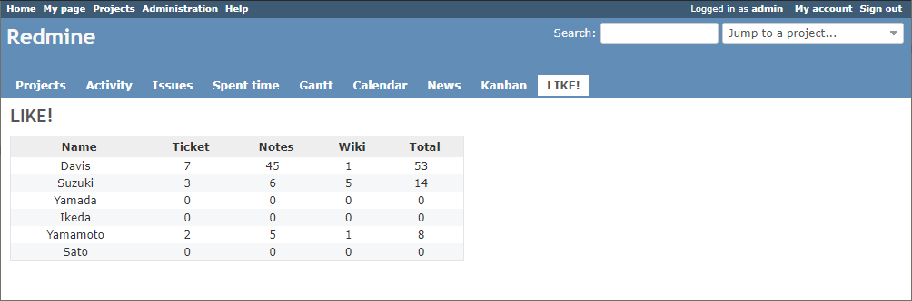

# Redmine like plugin
This plugin allows you to send the like on Redmine. It is a very simple plugin, so please modify it freely.

## What's new
* Added support for Redmine version 4.1 or later.
* Added email notification settings (on/off).

## Features
* You can like issues, notes and wikis.
* e-mail notifications when someone likes you.

## Screenshots

### Issues and notes

### Wiki

### 6 types of icons
* To change the icon, you need to change ICON_DESIGN in models/like_constants.rb.

### Display of total number of likes

## Install

1. Move to plugins folder.

2. Put the code.
<pre>
git clone https://github.com/happy-se-life/like.git
</pre>

3. Run migration.
<pre>
bundle exec rake redmine:plugins:migrate NAME=like RAILS_ENV=production
</pre>

4. Edit models/LikeConstants.rb to chose icon type.

5. Restart redmine.

## Uninstall

1. Move to plugins folder.

2. Rollback migration.
<pre>
bundle exec rake redmine:plugins:migrate NAME=like VERSION=0 RAILS_ENV=production
</pre>

3. Remove plugins folder.
<pre>
rm -rf like
</pre>

4. Restart redmine.

## Limitation
* Only supports English and Japanese.

## License
* MIT Lisense
