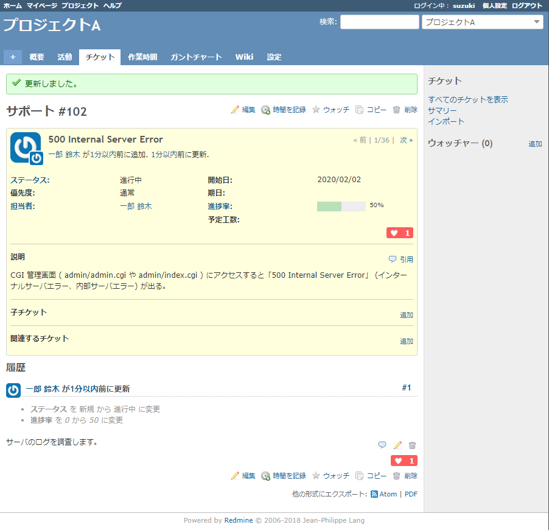

# Redmine like plugin
This plugin allows you to send the like on Redmine. It is a very simple plugin, so please modify it freely.

## What's new
* Added e-mail notification.
* Added icons animation.

## Features
* You can like tickets, notes and wikis.
* e-mail notification when you liked it.

## Screenshots

### Overview

### Like Total

## Install

1. Move to plugins folder.

2. Put the code.
<pre>
git clone https://github.com/happy-se-life/like.git
</pre>

3. Run migration.
<pre>
bundle exec rake redmine:plugins:migrate NAME=like RAILS_ENV=production
</pre>

4. Restart redmine.

## Uninstall

1. Move to plugins folder.

2. Rollback migration.
<pre>
bundle exec rake redmine:plugins:migrate NAME=like VERSION=0 RAILS_ENV=production
</pre>

3. Remove plugins folder.
<pre>
rm -rf like
</pre>

4. Restart redmine.

## Limitation
* Only supports English and Japanese.
* This is an experimental plugin.

## License
* MIT Lisense
